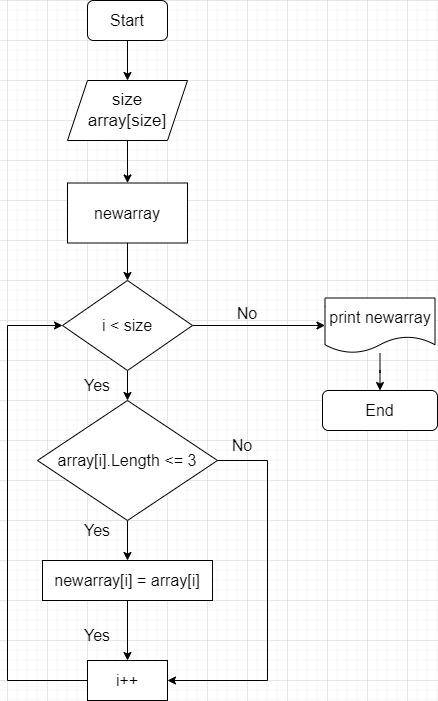

# **ИТОГОВАЯ ПРОВЕРОЧНАЯ РАБОТА** #

Для выполнения итоговой проверочной работы необходимо выполнить следующие этапы:
1. Создать репозиторий на GitHub
2. Нарисовать блок-схему алгоритма (можно обойтись блок-схемой основной содержательной части, если вы выделяете её в отдельный метод)
3. Снабдить репозиторий оформленным текстовым описанием решения (файл README.md)
4. Написать программу, решающую поставленную задачу
5. Использовать контроль версий в работе над этим небольшим проектом (не должно быть так, что всё залито одним коммитом, как минимум этапы 2, 3, и 4 должны быть расположены в разных коммитах)
---
**Задача**: Написать программу, которая из имеющегося массива строк формирует новый массив из строк, длина которых меньше, либо равна 3 символам. Первоначальный массив можно ввести с клавиатуры, либо задать на старте выполнения алгоритма. При решении не рекомендуется пользоваться коллекциями, лучше обойтись исключительно массивами.

Примеры:

[“Hello”, “2”, “world”, “:-)”] → [“2”, “:-)”]

[“1234”, “1567”, “-2”, “computer science”] → [“-2”]

[“Russia”, “Denmark”, “Kazan”] → []

# **ЭТАПЫ ВЫПОЛЕНИЯ РАБОТЫ** #
## ***1. Создан репозиторий на GitHub*** ##
**[ССЫЛКА НА РЕПОЗИТОРИЙ](https://github.com/NaeliaRu/FinalTestWork_Vaida)**

---
## ***2. Нарисована блок-схема алгоритма*** ##

**[ССЫЛКА НА БЛОК-СХЕМУ НА GITHUB](https://github.com/NaeliaRu/FinalTestWork_Vaida/blob/main/Diagram.jpg)**

---
## ***3. Написана программа для решения поставленной в работе задачи*** ##

Для решения поставленной задачи было написано три метода:
* Метод `string[] CreateArray()` создает массив на основе заданных пользователем данных
* Метод `void ShowArray(string[] array)` позволяет вывести полученный массив на экран
* Метод `string[] UserNewArray(string[] array)` принимает массив, созданный пользователя и формирует из него новый из строк изначального, длина которых меньше, либо равна 3 символам.
